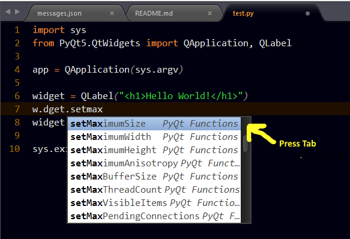

# PyQt AutoComplete

## About

A Sublime text package that pops up suggestions for common PyQt classes and components. It's purpose is to make coding easier and faster without the need for memorizing widget names or methods.

## Installation
> Important: You need to have `Package Control` installed first on your sublime text which can be found at [The Package Contol Website](http://packagecontrol.io)

### Using Package Control's Repository

Go to `Preferences` --> `Package Control` --> `Add Repository` --> then type into the textbox `https://github.com/tushortz/PyQt-AutoComplete`

After doing this, then go to: `Preferences` --> `Package Control` --> `Install Package` --> then search `PyQt-AutoComplete` and click it.

The package will be installed and ready for use.

### Download Manually

* Download the files using the GitHub .zip download option
* Unzip the files
* Copy the folder to your Sublime Text `Packages` directory

## How to Use

On a Python file in sublime text, type your desired component name or method and suggestions should follow. Press tab and autocomplete will be made.

## Contributing

All contributions are welcome. You can fork it on [Github](https://github.com/tushortz/PyQt-AutoComplete)

## License
© 2015 Taiwo Kareem | taiwo.kareem36@gmail.com.

Permission is hereby granted, free of charge, to any person obtaining a copy
of this software and associated documentation files (the "Software"), to deal
in the Software without restriction, including without limitation the rights
to use, copy, modify, merge, publish, distribute, sublicense, and/or sell
copies of the Software, and to permit persons to whom the Software is
furnished to do so, subject to the following conditions:

The above copyright notice and this permission notice shall be included in
all copies or substantial portions of the Software.

## Acknowledgements
I'd first like to say a very big thank you to God my creator. Without him, this wouldn't be possible.

